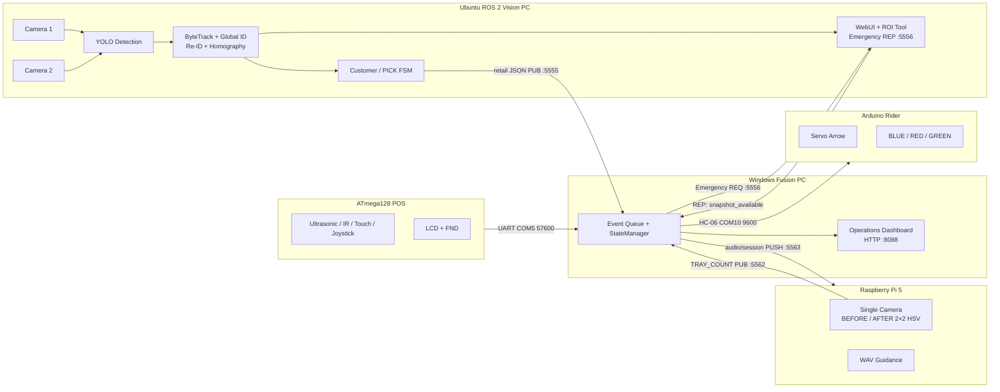

<div align="center">

# Bootivation

### 비전·POS·엣지 트레이를 결합한 무인매장 고객·배달기사 검증 시스템


**2026 SSG-SSAC 해커톤에서 구현한 멀티 디바이스 통합 프로젝트**  
고객 추적·상품 PICK·POS 결제·계산 전후 트레이·배달기사 안내를 하나의 Fusion 상태머신에서 결합합니다.

[전체 실행 순서](docs/RUNBOOK.md) · [시스템 구조](docs/ARCHITECTURE.md) · [통신 규격](docs/PROTOCOLS.md) · [Vision 상세](docs/VISION_INTEGRATION.md)

</div>

---

## 1. 프로젝트 한눈에 보기

기존 무인매장은 카메라 인식, 결제 장치, 상품 이동, 배달기사 픽업 장치가 서로 독립적으로 동작하기 쉽습니다. Bootivation은 각 장치가 만든 장부를 중앙 Fusion PC에서 교차 검증하여 **정상 결제, 부분 결제, 미결제, 잘못된 픽업, 트레이 불일치**를 구분하는 것을 목표로 했습니다.

| 사용자 | 검증 흐름 | 최종 결과 |
|---|---|---|
| 고객 | Vision PICK 수량 → ATmega128 POS 결제 → RPi 계산 전·후 트레이 비교 | 정상 결제 / 부분 결제 / 미결제 / 트레이 불일치 |
| 배달기사 | 주문 수량 → Vision 선반 제거량 → Rider POS 최종 확인량 | 정상 픽업 / 누락 / 오픽업 / 확인 불일치 |
| 운영자 | Fusion 이벤트·장치 상태·경보 확인 | 로컬 대시보드, LED, WAV, Vision WebUI Emergency |

### 고객 시나리오

```text
입장·전역 customer_id 발급
→ A/B/C 상품 PICK 누적
→ POS 접근 및 결제
→ 계산 전 트레이에서 계산 후 트레이로 이동
→ Fusion이 PICK / 결제 / 트레이 수량 비교
→ 정상 통과 또는 미결제·불일치 경보
```

미결제 또는 절도 의심 상황에서는 Fusion이 Vision WebUI의 ZMQ Emergency 채널로 고객 ID를 보내고, WebUI가 큰 경보 문구와 해당 고객의 입장 스냅샷을 표시하도록 설계했습니다.

### 배달기사 시나리오

```text
주문 A/B/C 수량 등록
→ BLUE LED + 첫 상품 방향 안내
→ Vision이 실제 선반 제거량 집계
→ 상품별 서보 화살표 순차 이동
→ 전량 수집 후 HOME
→ Rider POS에서 가져온 상품 최종 확인
→ 주문 = Vision 제거 = POS 확인이면 GREEN
→ 하나라도 다르면 RED
```

---

## 2. 전체 시스템 구조



세부 책임과 이벤트 흐름은 [`docs/ARCHITECTURE.md`](docs/ARCHITECTURE.md)에 정리했습니다.

---

## 3. 주요 개발 내용

### 3.1 Ubuntu ROS 2 Vision · CCTV WebUI

Vision 원본은 도율님의 별도 저장소에서 관리합니다.

- **Upstream:** [Kuz-DX/ssg-ssac-cctv](https://github.com/Kuz-DX/ssg-ssac-cctv)
- **아카이브 기준 커밋:** [`3d9225e` — Final Code](https://github.com/Kuz-DX/ssg-ssac-cctv/commit/3d9225ebf47c9cbe7a231fe56d4bd2244c4696ef)

구현 내용:

- 두 USB 카메라의 압축 영상 토픽 구독
- 통합 YOLO 모델로 사람·손·A/B/C 상품 검출
- 상품·손 전용 보조 모델 결과 병합 및 중복 박스 제거
- 카메라별 ByteTrack 방식 로컬 추적
- OpenVINO Person Re-ID와 Homography 기반 전역 고객 ID 통합
- 출입구·키오스크·A/B/C 다각형 ROI
- 다중 프레임 PICK FSM과 멀티뷰 중복 제거
- 고객 입장·퇴장 lifecycle 관리
- WebUI 실시간 영상, 추적 ID, ROI 좌표 도구
- `retail {JSON}` ZMQ 송신과 Emergency 스냅샷 경보

자세한 구조, 모델 클래스, 실행 명령은 [`docs/VISION_INTEGRATION.md`](docs/VISION_INTEGRATION.md)를 참고하세요.

### 3.2 Fusion PC

- POS, Rider, RPi, Vision 이벤트를 단일 큐로 결합
- 고객별 PICK·결제 장부 및 배달기사 3중 장부 관리
- POS `PAY_DONE` 일반/상세 메시지 중복 집계 방지
- Rider 명령 사이 지연을 두어 HC-06 연속 명령 유실 방지
- 정상 결제·부분 결제·완전 미결제·오픽업·트레이 불일치 판정
- RPi WAV 이벤트 송신
- 운영자 로컬 HTTP 대시보드와 JSONL 이벤트 로그
- 미결제 시 Rider RED, 경고음, Vision WebUI Emergency 연계

### 3.3 ATmega128 POS

- 기존 ASM 동작을 기능별 C 모듈로 재구성
- 초음파 사람 접근 → CUSTOMER/RIDER 선택 → IR 상품 감지 → A/B/C/DONE 입력
- LCD·FND 안내와 세션별 상품 수량 표시
- UART0 57600 bps CSV 프로토콜
- `SESSION_RESET`, `COUNT`, `PAY_DONE` 상세 요약 지원

### 3.4 Rider Arduino

- HC-06 Bluetooth Classic SPP로 Fusion 명령 수신
- 상품 위치 화살표와 3색 LED 안내
- 최종 보정 각도: `A=85°`, `B=45°`, `C=0°`, `HOME=150°`
- 명령: `SERVO:A/B/C/HOME`, `LED:BLUE/RED/GREEN/OFF`, `RESET`, `PING`
- App Inventor 프로토타입은 장치 점검·비상 제어 용도로 보존

### 3.5 Raspberry Pi 계산 트레이

- 최종 시연에서는 IMX219 한 대로 BEFORE·AFTER 트레이를 동시에 촬영
- 각 트레이를 2×2 슬롯으로 나눠 `A / B / C / EMPTY` 분류
- 카메라 설치 후 ROI와 HSV 범위를 현장에서 저장
- 프레임 다수결로 수량 안정화
- Fusion으로 `TRAY_COUNT` 송신, Fusion 명령에 따라 WAV 재생

---

## 4. 팀 역할

| 팀원 | 주요 담당 | 핵심 결과물 |
|---|---|---|
| **시은** | PM·서비스 기획·발표 | 사용자 흐름, 기능 우선순위, 발표·운영 조율 |
| **박주은** [@tigerjueun](https://github.com/tigerjueun) | Fusion PC, 통신 통합, RPi 트레이·음성, Rider 펌웨어 보정 | 상태머신, POS/Rider/RPi/Vision 연동, ZMQ·Serial |
| **혜은** | ATmega128 POS, RPi 트레이·음성 | 기존 ASM 분석, C 모듈화, 센서·LCD·FND·결제 UI, 실물 회로 |
| **진호** | Rider Arduino·모바일 프로토타입 | HC-06, 서보 화살표, LED 회로, App Inventor 점검 앱 |
| **도율** [@Kuz-DX](https://github.com/Kuz-DX) | Ubuntu ROS 2 Vision·CCTV WebUI | YOLO, 추적, Re-ID, Homography, PICK FSM, ROI 도구, ZMQ 5555/5556 |

역할은 각자의 **주요 담당 영역**을 기준으로 정리했으며, 실제 현장에서는 전원이 하드웨어 조립·시험·통합에 함께 참여했습니다. 자세한 기록은 [`TEAM.md`](TEAM.md)를 참고하세요.

---

## 5. 기술 스택

| 영역 | 기술 |
|---|---|
| Vision | Ubuntu 22.04, ROS 2 Humble, Python 3.10, Ultralytics YOLO, OpenCV, OpenVINO, ByteTrack 방식 추적 |
| Fusion | Python, pyserial, pyzmq, JSONL, HTTP dashboard |
| Edge Tray | Raspberry Pi 5, Picamera2, OpenCV HSV, PipeWire WAV |
| POS | ATmega128, AVR-GCC C, UART, LCD/FND, IR·초음파·터치·조이스틱 |
| Rider | Arduino UNO, Servo, HC-06, Bluetooth SPP, 3색 LED |
| 통신 | UART, Bluetooth virtual COM, ZeroMQ PUB/SUB·PUSH/PULL·REQ/REP |

---

## 6. 통신 채널

| 방향 | 방식 | 포트/속도 | 데이터 |
|---|---|---:|---|
| Vision → Fusion | ZMQ PUB/SUB | `5555` | `retail {JSON}` 고객 POS/EXIT 상태 |
| Fusion → Vision WebUI | ZMQ REQ/REP | `5556` | `Emergency=true`, `customer_id`, 스냅샷 응답 |
| RPi → Fusion | ZMQ PUB/SUB | `5562` | `TRAY_COUNT` |
| Fusion → RPi | ZMQ PUSH/PULL | `5563` | 결제 확정, 초기화, WAV 이벤트 |
| POS → Fusion | UART | `COM5 / 57600` | `USER`, `PAY`, `COUNT`, `PAY_DONE` |
| Fusion → Rider | Bluetooth SPP serial | `COM10 / 9600` | `SERVO:*`, `LED:*`, `RESET` |
| Fusion → Browser | HTTP | `8088` | 운영 상태·경보 UI |
| Vision WebUI → Browser | HTTP/WebSocket | `8080` | CCTV·추적·ROI·Emergency UI |

정확한 payload와 주의사항은 [`docs/PROTOCOLS.md`](docs/PROTOCOLS.md)에 있습니다.

---

## 7. 저장소 구조

```text
2026_Bootivation/
├── fusion_pc/                 # 중앙 상태머신·통신·운영 UI
├── firmware/
│   ├── atmega128_pos/         # POS C 소스·핀맵·UART 문서
│   └── rider_arduino/         # HC-06·서보·LED 최종 펌웨어
├── edge/rpi_tray/             # HSV 2트레이·ZMQ·WAV
├── vision/
│   ├── README.md              # Vision 통합 안내
│   ├── UPSTREAM.md            # 도율님 원본 저장소·커밋 정보
│   ├── contracts/             # 5555 / 5556 계약
│   └── mock/                  # 수동 송신 테스트
├── models/                    # 모델 파일 배치·Git LFS 안내
├── apps/app_inventor/         # 장치 점검용 앱 설명
├── shared/schemas/            # ZMQ JSON Schema
├── scripts/                   # 실행 스크립트
├── docs/                      # 아키텍처·런북·개발 기록
├── TEAM.md
└── README.md
```

Vision 전체 소스는 기여자의 커밋 이력과 소유권을 보존하기 위해 별도 upstream 저장소를 기준으로 연결합니다. 함께 내려받을 때는 [`vision/UPSTREAM.md`](vision/UPSTREAM.md)의 명령을 사용하세요.

---

## 8. 빠른 시작

### 저장소

```bash
git clone https://github.com/tigerjueun/2026_Bootivation.git
cd 2026_Bootivation
```

### Vision PC

```bash
git clone https://github.com/Kuz-DX/ssg-ssac-cctv.git vision/ssg-ssac-cctv
cd vision/ssg-ssac-cctv
./webUI/run_model_test.sh
```

최종 upstream에서는 고객 상태 ZMQ 송신 노드를 별도 터미널에서 실행해야 합니다. 상세 명령은 [`docs/RUNBOOK.md`](docs/RUNBOOK.md)를 참고하세요.

### Raspberry Pi

```bash
cd ~/Bootivation/rpi_tray_single
python3 single_slot_counter_zmq_audio.py \
  --bind 'tcp://*:5562' \
  --command-bind 'tcp://*:5563'
```

### Fusion PC

```powershell
cd fusion_pc
py -m pip install -r requirements.txt
Copy-Item .\config\system.example.json .\config\system.json
py .\main.py `
  --config .\config\system.json `
  --rpi-endpoint tcp://10.77.0.2:5562 `
  --rpi-command-endpoint tcp://10.77.0.2:5563
```

- Fusion dashboard: `http://127.0.0.1:8088`
- Vision WebUI: `http://VISION_PC_IP:8080`

---

## 9. 검증 시나리오

| 시나리오 | 기대 결과 |
|---|---|
| 고객 PICK = POS 결제 = AFTER 트레이 | 정상 완료, 경보 없음 |
| PICK > POS 결제 | 상품별 미결제 계산, RED·WAV·Emergency |
| 고객이 POS를 거치지 않고 EXIT | 완전 미결제 경보 |
| POS 결제와 AFTER 종류/수량 불일치 | `TRAY_MISMATCH` 음성·대시보드 경보 |
| Rider 주문 = Vision 제거 = POS 확인 | GREEN + HOME + `PICKUP_COMPLETE` |
| 주문에 없는 Rider 상품 제거 | RED + 오픽업 결과 |
| Vision/RPi 스트림 중단 | 장치 stale 상태 표시 |

테스트 행렬은 [`docs/SCENARIO_MATRIX.md`](docs/SCENARIO_MATRIX.md)에 있습니다.

---

## 10. 구현 과정에서 해결한 문제

- POS 일반 `PAY_DONE`과 상세 요약의 **중복 결제 집계 방지**
- Rider POS 확인량과 Vision 실제 제거량의 **의미 분리**
- HC-06에서 LED와 서보 연속 명령이 누락되는 문제를 **명령 간격과 ACK 경로 조정**으로 완화
- RPi 듀얼 CSI 문제 발생 시 **단일 카메라·양쪽 트레이 구조로 전환**
- 현장 조명 차이를 반영해 **BEFORE/AFTER 개별 HSV 캘리브레이션**
- Vision의 카메라별 ID를 **Re-ID + Homography 기반 전역 고객 ID**로 통합
- 순간 겹침을 PICK으로 오판하지 않도록 **다중 프레임 이동 FSM과 ROI gating** 적용
- 미결제 시 고객 ID를 이용해 **Vision WebUI의 입장 스냅샷과 경보를 연결**

상세 개발 회고는 [`docs/DEVELOPMENT_SUMMARY.md`](docs/DEVELOPMENT_SUMMARY.md)에 정리했습니다.

---

## 11. 현재 범위와 제한사항

- Vision 최종 upstream은 `5555`에서 고객별 **POS/EXIT 전환 패킷을 각각 한 번** 전송합니다. PUB/SUB는 과거 패킷을 재전송하지 않으므로 Fusion을 먼저 실행해야 합니다.
- 상품 RETURN과 수량 감소는 최종 Vision 범위에 포함되지 않았습니다.
- RPi 최종 시연은 카메라 한 대가 두 트레이를 동시에 보는 fallback 구조입니다.
- 모델 가중치는 크기와 원 라이선스 문제로 이 저장소에 직접 포함하지 않았습니다. 필요한 파일명과 배치 위치는 [`models/README.md`](models/README.md)에 있습니다.
- ZMQ 통신에는 인증·암호화가 없으므로 신뢰 가능한 내부망과 방화벽을 사용해야 합니다.
- 각 기여자의 소스와 외부 모델은 해당 원본 저장소·라이선스·기여자 권리를 따릅니다.

---

## 12. 프로젝트 상태

- [x] POS C 펌웨어 및 UART 계약 정리
- [x] Rider Arduino 최종 각도·명령 정리
- [x] RPi 트레이·음성·ZMQ 정리
- [x] Fusion 상태머신·경보·운영 UI 정리
- [x] 도율님 Vision upstream 연결 및 최종 프로토콜 반영
- [x] 팀 역할·아키텍처·실행 문서 정리
- [ ] 모델 가중치 별도 보관 및 Git LFS/배포 정책 확정
- [ ] 최종 데모 사진·영상 추가

---

## 13. Credits

- Vision/ROS2/CCTV WebUI: [Kuz-DX/ssg-ssac-cctv](https://github.com/Kuz-DX/ssg-ssac-cctv)
- 시스템 통합 아카이브: [tigerjueun/2026_Bootivation](https://github.com/tigerjueun/2026_Bootivation)

이 저장소는 수상 여부와 별개로, 짧은 해커톤에서 서로 다른 하드웨어·운영체제·통신 방식을 실제로 연결한 과정과 결과를 팀 자산으로 남기기 위해 정리했습니다.
