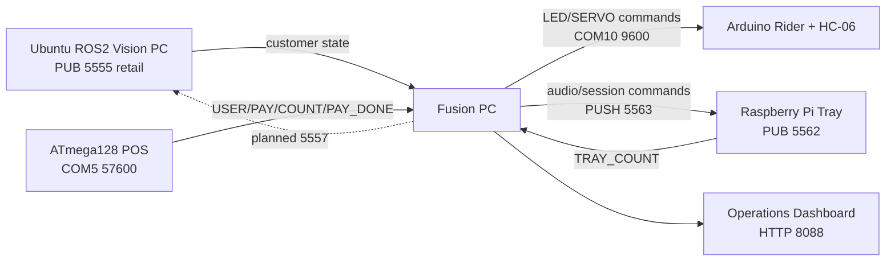

# Architecture

```mermaid
flowchart LR
  V[Ubuntu ROS2 Vision PC\nPUB 5555 retail] -->|customer state| F[Fusion PC]
  P[ATmega128 POS\nCOM5 57600] -->|USER/PAY/COUNT/PAY_DONE| F
  F -->|LED/SERVO commands\nCOM10 9600| R[Arduino Rider + HC-06]
  T[Raspberry Pi Tray\nPUB 5562] -->|TRAY_COUNT| F
  F -->|audio/session commands\nPUSH 5563| T
  F --> U[Operations Dashboard\nHTTP 8088]
  F -. planned 5557 .-> V
```

## 책임 분리

- Vision: 고객 추적과 구역별 누적 픽업 수량
- POS: 고객/라이더 상품 확인과 결제 장부
- RPi: 계산 전·후 트레이 HSV 수량, WAV 안내
- Rider Arduino: 상품 위치 화살표와 상태 LED
- Fusion: 모든 이벤트 결합, 상태머신, 경보, 운영 UI
