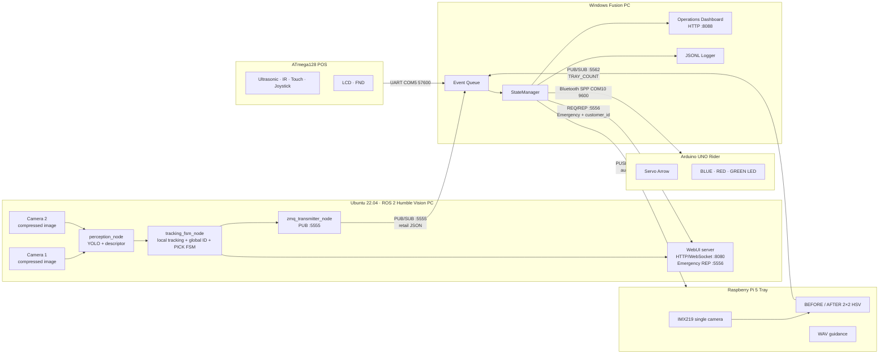
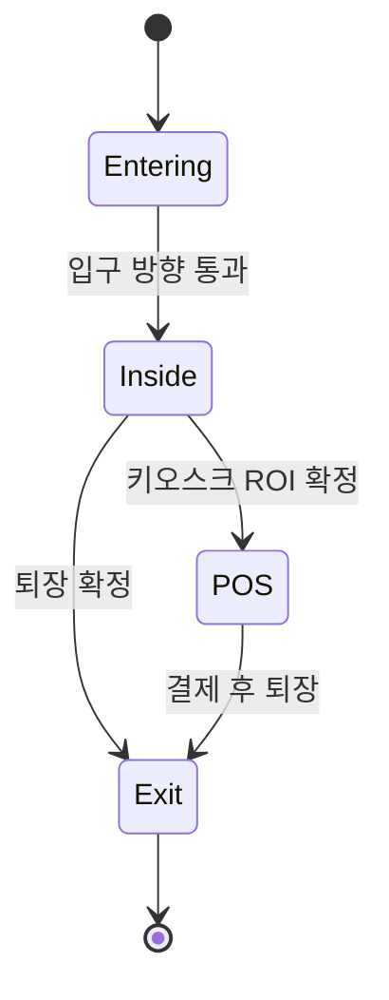

# System Architecture

## 1. Logical architecture



## 2. Responsibility boundaries

### Vision PC

- 카메라 영상 수집과 저지연 ROS 2 파이프라인
- 사람·손·상품 A/B/C 검출
- 카메라별 로컬 추적과 전역 `customer_id` 통합
- 출입구·키오스크·상품 구역 ROI
- 다중 프레임 PICK FSM과 고객 lifecycle
- `state=POS` / `state=EXIT` 고객 상태를 ZMQ 5555로 송신
- Emergency 요청 수신 후 고객 입장 스냅샷을 WebUI에 표시

### Fusion PC

- 모든 외부 이벤트의 시각·의미를 중앙 상태로 통합
- 고객 PICK, POS 결제, RPi 트레이 장부 비교
- 배달기사 주문, Vision 제거, Rider POS 확인의 3중 검증
- Rider 서보·LED 제어
- RPi 음성·세션 제어
- 미결제·불일치·장치 오류 경보 및 운영 UI

### ATmega128 POS

- 사용자 접근과 CUSTOMER/RIDER 선택
- 상품 A/B/C 입력 및 DONE
- LCD/FND 로컬 UI
- 세션·수량·완료 메시지를 UART로 전송

### Rider Arduino

- Fusion이 지정한 상품 방향으로 서보 이동
- BLUE: 진행, GREEN: 완료, RED: 오류
- HC-06 Bluetooth SPP를 통한 명령 수신

### Raspberry Pi Tray

- 계산 전·후 트레이의 2×2 슬롯 분류
- A/B/C/EMPTY 수량 안정화
- ZMQ로 최신 트레이 상태 송신
- Fusion 명령에 따라 WAV 안내

## 3. Customer state flow



Vision upstream의 최종 ZMQ transmitter는 고객별 `POS`와 `EXIT` 전환 패킷을 각각 한 번 송신합니다. 따라서 Fusion은 `customer_id`로 POS 상태를 보관하고 EXIT 패킷의 최종 PICK 수량과 결제 장부를 비교해야 합니다.

## 4. Rider 3-way verification

```text
order_items          주문/앱 장부
rider_removed        Vision이 확인한 실제 선반 제거량
rider_checked_items  Rider POS가 확인한 출점 전 상품량
```

```text
order = removed = checked
→ PICKUP_COMPLETE / GREEN / HOME

removed > order 또는 주문 외 상품
→ WRONG_PICKUP / RED

order = removed, checked 불일치
→ RIDER_POS_MISMATCH / RED
```

## 5. Customer payment verification

```text
picked = Vision EXIT 패킷의 A/B/C 누적 PICK
paid   = 동일 customer_id에 연결된 POS 결제 수량
unpaid = max(picked - paid, 0)
```

- `picked == paid`: 정상 통과
- `paid == 0 && picked > 0`: 완전 미결제
- 일부만 결제: 부분 결제
- 트레이 AFTER가 POS expected와 다름: 계산 트레이 불일치

미결제 시 Fusion은 Rider RED와 RPi 경고음을 발생시키고, Vision WebUI의 5556 Emergency 채널로 고객 ID를 전달할 수 있습니다.

## 6. Network topology

```text
Vision PC ── Wi-Fi/LAN ── Fusion PC
  :5555 PUB                  SUB
  :5556 REP                  REQ

RPi 10.77.0.2 ── dedicated Ethernet ── Fusion 10.77.0.1
  :5562 PUB                              SUB
  :5563 PULL                             PUSH

ATmega128 ── USB UART COM5 ── Fusion
Arduino HC-06 ── Bluetooth COM10 ── Fusion
```

Ethernet에는 기본 게이트웨이를 두지 않아 Fusion과 RPi 통신만 전용망으로 분리하고, 인터넷은 Wi-Fi를 사용하도록 구성했습니다.
